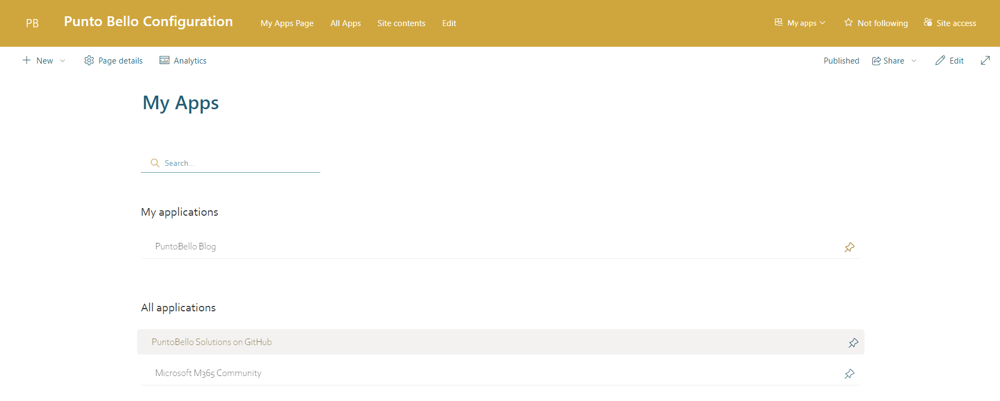

# User Apps webpart

## Summary
This web part displays a list of all available apps alongside the user’s favorited apps.

### Features
The user is presented with two lists of apps:

- Favorited apps selected by the user.
- All available apps within the organization.  

The user can pin or unpin apps and rearrange the list of favorited apps in a custom order. The favorited apps are then displayed through the User Apps Extension.  

This SPFx solution is to be used with the [PuntoBello User Apps Extension](../puntobello-userapps-extension/README.md).

### Parameters
You can configure all the parameters in the corresponding files located in the `env` directory. Once set, build the solution accordingly.

| Parameter                              | Description                                                              |
|----------------------------------------|--------------------------------------------------------------------------|
| SPFX_COLOR_TEXT                        | The primary color used for text throughout the application.              |
| SPFX_COLOR_TEXT_BRIGHTNESS_DARK        | Darker brightness adjustment for the text color. Should be less than 1.  |
| SPFX_COLOR_GREY                        | Standard grey color used for backgrounds or secondary elements.          |
| SPFX_COLOR_GREY_BRIGHTNESS_BRIGHT      | Brighter variant of the grey color. Should be higher than 1.             |
| SPFX_COLOR_GREY_BRIGHTNESS_DARK        | Darker variant of the grey color. Should be less than 1.                 |
| SPFX_COLOR_PINNED                      | Color used for pinned items or highlights.                               |
| SPFX_BORDER_RADIUS                     | Radius for rounding the corners of elements.                             |
| SPFX_FONT_FAMILY                       | The font family used across the application.                             |
| SPFX_FONT_SIZE_GENERIC                 | The standard font size used for general text.                            |
| SPFX_FONT_SIZE_TITLE                   | The font size used specifically for titles and headings.                 |
| SPFX_SITE_CONFIG                       | Configuration setting related to site-specific parameters.               |
| SPFX_LIST_USERAPPS                     | List identifier for user applications.                                   |
| SPFX_LIST_APPS                         | List identifier for general applications.                                |
| SPFX_PAGE_MANAGEMENT_APPS              | Page name used for managing user applications.                           |

### _Note_
* Uses PnP-Js library for all rest interactions with sharepoint.

## Compatibility

 

## Solution

Solution|Author(s)
--------|---------
puntobello-userapps-spwp | Nello D'Andrea, die Mobiliar

## Version history

Version|Date|Comments
-------|----|--------
1.2.0   | July 2025 | Upgraded with Pantoum SPFx AI Upgrader
1.1.0   | July 2025 | Upgraded with Pantoum SPFx AI Upgrader
1.0.0|September 2024|Initial release

## License
[MIT License](../LICENSE.md)

## Acknowledgment Request

If you find this software useful and incorporate it into your own projects, especially for commercial purposes, we kindly ask that you acknowledge its use. This acknowledgment can be as simple as mentioning "Powered by Die Mobiliar - PuntoBello" in your product's documentation, website, or any related materials.

While this is not a requirement of the MIT License and is entirely voluntary, it helps support and recognize the efforts of the developers who contributed to this project. We appreciate your support!